# NanoBrain: The Definitive Guide to Large Language Models (LLMs)

Welcome to the official **NanoBrain** repository documentation and masterclass wiki. This repository contains a clean, high-performance, modular implementation of a 124-Million parameter Generative Pre-trained Transformer (GPT-2 Small architecture) built in PyTorch.

This document serves as an exhaustive, first-principles textbook and technical guide. It is structured into two main parts:
1. **Theoretical Foundations & Alignment (Modules 1–6):** Mathematical, architectural, hardware, algorithmic, and fine-tuning mechanics powering modern Large Language Models.
2. **Implementation Deep Dive (Module 7):** A file-by-file walkthrough of the NanoBrain codebase.

> **Rendering Note:** This document contains mathematical formulas formatted in LaTeX ($...$ and $$...$$). For optimal rendering, view this file on GitHub or in a Markdown previewer with MathJax / KaTeX support enabled.

---

# Table of Contents
- [NanoBrain: The Definitive Guide to Large Language Models (LLMs)](#nanobrain-the-definitive-guide-to-large-language-models-llms)
- [Table of Contents](#table-of-contents)
- [PART 1: THEORETICAL FOUNDATIONS \& ALIGNMENT](#part-1-theoretical-foundations--alignment)
  - [Module 1: Language Modeling Fundamentals](#module-1-language-modeling-fundamentals)
    - [1.1 Mathematical Formulation of Language Modeling](#11-mathematical-formulation-of-language-modeling)
    - [1.2 Historical Evolution: From N-Grams to Recurrent Neural Networks](#12-historical-evolution-from-n-grams-to-recurrent-neural-networks)
    - [1.3 The Bottlenecks of Sequential Models](#13-the-bottlenecks-of-sequential-models)
  - [Module 2: The Transformer Decoder Architecture](#module-2-the-transformer-decoder-architecture)
    - [2.1 High-Dimensional Vector Spaces and Embedding Representation](#21-high-dimensional-vector-spaces-and-embedding-representation)
    - [2.2 Tokenization Mechanics: Byte-Pair Encoding (BPE)](#22-tokenization-mechanics-byte-pair-encoding-bpe)
    - [2.3 Positional Representations: Absolute vs. Rotary (RoPE)](#23-positional-representations-absolute-vs-rotary-rope)
    - [2.4 Causal Multi-Head Self-Attention (MHSA)](#24-causal-multi-head-self-attention-mhsa)
    - [2.5 Non-Linear Activations: GELU vs. ReLU vs. SwiGLU](#25-non-linear-activations-gelu-vs-relu-vs-swiglu)
    - [2.6 Normalization Topologies and The Residual Highway](#26-normalization-topologies-and-the-residual-highway)
    - [2.7 Weight Tying Mechanics](#27-weight-tying-mechanics)
  - [Module 3: Computational and Hardware Optimizations](#module-3-computational-and-hardware-optimizations)
    - [3.1 GPU Memory Architecture: SRAM vs. HBM](#31-gpu-memory-architecture-sram-vs-hbm)
    - [3.2 FlashAttention: Tiling, Online Softmax, and Kernel Fusion](#32-flashattention-tiling-online-softmax-and-kernel-fusion)
    - [3.3 Numerical Precision Formats: FP32, FP16, BF16, TF32](#33-numerical-precision-formats-fp32-fp16-bf16-tf32)
    - [3.4 Mixed-Precision Training (AMP) and Gradient Scaling](#34-mixed-precision-training-amp-and-gradient-scaling)
    - [3.5 Gradient Accumulation and Gradient Clipping](#35-gradient-accumulation-and-gradient-clipping)
    - [3.6 Weight Decay, Fused AdamW, and Learning Rate Scheduling](#36-weight-decay-fused-adamw-and-learning-rate-scheduling)
    - [3.7 Exponential Moving Average (EMA) of Weights](#37-exponential-moving-average-ema-of-weights)
  - [Module 4: Text Generation and Decoding Mechanics](#module-4-text-generation-and-decoding-mechanics)
    - [4.1 Autoregressive Sampling Loop](#41-autoregressive-sampling-loop)
    - [4.2 Softmax Temperature Scaling](#42-softmax-temperature-scaling)
    - [4.3 Truncation Algorithms: Top-K and Top-p (Nucleus) Sampling](#43-truncation-algorithms-top-k-and-top-p-nucleus-sampling)
    - [4.4 Key-Value (KV) Caching During Inference](#44-key-value-kv-caching-during-inference)
  - [Module 5: Modern Industry Evolution and Comparative Architecture](#module-5-modern-industry-evolution-and-comparative-architecture)
    - [5.1 Architectural Shift: GPT-2 (NanoBrain) vs. LLaMA 1/2/3 and Mistral](#51-architectural-shift-gpt-2-nanobrain-vs-llama-123-and-mistral)
    - [5.2 Grouped-Query Attention (GQA) and Multi-Query Attention (MQA)](#52-grouped-query-attention-gqa-and-multi-query-attention-mqa)
  - [Module 6: Post-Pretraining Pipeline: Alignment and Fine-Tuning](#module-6-post-pretraining-pipeline-alignment-and-fine-tuning)
    - [6.1 Supervised Fine-Tuning (SFT)](#61-supervised-fine-tuning-sft)
    - [6.2 Reinforcement Learning from Human Feedback (RLHF) \& PPO](#62-reinforcement-learning-from-human-feedback-rlhf--ppo)
    - [6.3 Direct Preference Optimization (DPO)](#63-direct-preference-optimization-dpo)
    - [6.4 Instruction Templates and Chat Formats](#64-instruction-templates-and-chat-formats)
- [PART 2: CODEBASE ARCHITECTURE AND IMPLEMENTATION](#part-2-codebase-architecture-and-implementation)
  - [Module 7: NanoBrain Codebase Walkthrough](#module-7-nanobrain-codebase-walkthrough)
    - [7.1 Hyperparameter Configuration (config.py / config.json)](#71-hyperparameter-configuration-configpy--configjson)
    - [7.2 Data Sourcing and Pre-Processing (build_dataset.py)](#72-data-sourcing-and-pre-processing-build_datasetpy)
    - [7.3 Binary Packing and Zero-Copy Data Loading (tokenize_dataset.py and dataset.py)](#73-binary-packing-and-zero-copy-data-loading-tokenize_datasetpy-and-datasetpy)
    - [7.4 PyTorch Model Implementation (model.py)](#74-pytorch-model-implementation-modelpy)
    - [7.5 Unified Training Engine (trainer.py and train.py)](#75-unified-training-engine-trainerpy-and-trainpy)
      - [7.5.1 Reading Training Logs and Loss Curves](#751-reading-training-logs-and-loss-curves)
    - [7.6 Text Generation Script (generate.py)](#76-text-generation-script-generatepy)
- [Appendix A: Glossary and Quick Reference](#appendix-a-glossary-and-quick-reference)
- [Appendix B: References and Further Reading](#appendix-b-references-and-further-reading)
- [Summary and Best Practices for Experimentation](#summary-and-best-practices-for-experimentation)

---

# PART 1: THEORETICAL FOUNDATIONS & ALIGNMENT

---

## Module 1: Language Modeling Fundamentals

### 1.1 Mathematical Formulation of Language Modeling

> **Intuition:** A Language Model is an advanced word-predictor. Given a sequence of words, its goal is to assign a probability to every possible next word in its dictionary, picking the most plausible option based on context. During training, we show it millions of sentences and penalize it whenever it assigns a low probability to the actual next word.

At its core, formal language modeling frames natural language generation as a joint probability distribution estimation problem over sequence variables. Given a sequence of $N$ discrete tokens $X = (x_1, x_2, \dots, x_N)$, the joint probability $P(X)$ of observing the sequence is factored auto-regressively via the probabilistic chain rule:

$$P(X) = P(x_1, x_2, \dots, x_N) = \prod_{t=1}^N P(x_t \mid x_1, x_2, \dots, x_{t-1})$$

```text
Fallback: P(X) = P(x1) * P(x2|x1) * P(x3|x1,x2) * ... * P(xN|x1,...,xN-1)
```

In a causal (or auto-regressive) language model, the network parameterizes the conditional probability distribution $P(x_t = k \mid x_{<t})$ over a finite vocabulary set $V$:

$$P(x_t = k \mid x_{<t}; \theta) = \text{softmax}(z_t)_k = \frac{\exp(z_{t, k})}{\sum_{j=1}^{|V|} \exp(z_{t, j})}$$

where $\theta$ represents the trainable weights of the neural network and $z_t \in \mathbb{R}^{|V|}$ represents the raw unnormalized logit scores predicted at step $t$.

Training an LLM consists of minimizing the empirical cross-entropy loss over a corpus of $T$ tokens:

$$\mathcal{L}_{CE}(\theta) = -\frac{1}{T} \sum_{t=1}^T \log P(x_t^{\text{target}} \mid x_1, \dots, x_{t-1}; \theta)$$

```text
Fallback: Loss = -(1/T) * sum[ log P(target_word_t | all_previous_words) ]
```

where $x_t^{\text{target}}$ is the target ground-truth token index at position $t$.

```
Text Sequence: "The quick brown fox jumps"
Step 1: P("The" | <START>)
Step 2: P("quick" | "The")
Step 3: P("brown" | "The", "quick")
Step 4: P("fox" | "The", "quick", "brown")
Step 5: P("jumps" | "The", "quick", "brown", "fox")
```

---

### 1.2 Historical Evolution: From N-Grams to Recurrent Neural Networks

> **Intuition:** Early AI models tried to predict the next word by looking only at the last 2 or 3 words ($N$-grams) or by passing a single running memory vector down a chain of words (RNNs). While RNNs were a big step forward, they forced computers to read words one by one, creating a huge bottleneck.

<p align="center">
  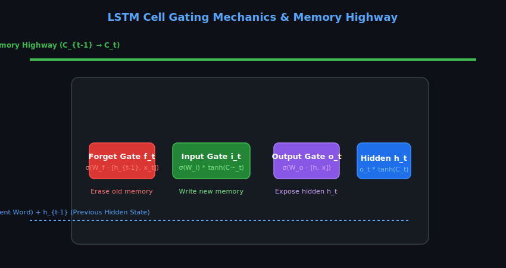
  <br>
  <em>LSTM Cell Gating Mechanics &amp; Memory Highway Architecture.</em>
</p>

1. **$N$-Gram Language Models:** Relied on the strict Markov assumption that the probability of word $x_t$ depends only on the preceding $N-1$ words:
   $$P(x_t \mid x_{<t}) \approx P(x_t \mid x_{t-N+1}, \dots, x_{t-1})$$
   *Limitations:* Combinatorial explosion of storage tables ($|V|^N$) and zero generalization to unseen sequences without smoothing techniques.

2. **Recurrent Neural Networks (RNNs & LSTMs):** Processed text sequentially by updating an internal hidden vector state $h_t \in \mathbb{R}^d$:
   $$h_t = \text{tanh}(W_{hh} h_{t-1} + W_{xh} x_t + b_h)$$
   
   **Long Short-Term Memory (LSTM) Gating Mechanics:** To prevent gradient vanishing, Hochreiter & Schmidhuber introduced a continuous cell memory highway $C_t$ governed by three adaptive gates:
   - **Forget Gate ($f_t$):** Controls what past memory to erase:
     $$f_t = \sigma(W_f \cdot [h_{t-1}, x_t] + b_f)$$
   - **Input Gate ($i_t$) & Candidate State ($\tilde{C}_t$):** Controls what new information to write into memory:
     $$i_t = \sigma(W_i \cdot [h_{t-1}, x_t] + b_i), \quad \tilde{C}_t = \text{tanh}(W_c \cdot [h_{t-1}, x_t] + b_c)$$
     $$C_t = f_t \odot C_{t-1} + i_t \odot \tilde{C}_t$$
   - **Output Gate ($o_t$):** Filters what cell memory to expose as hidden output $h_t$:
     $$o_t = \sigma(W_o \cdot [h_{t-1}, x_t] + b_o), \quad h_t = o_t \odot \text{tanh}(C_t)$$

```text
Fallback:
Forget(f) = sigmoid(Wf * [h, x] + bf)
Input(i) = sigmoid(Wi * [h, x] + bi)
Cell(C) = f * C_prev + i * tanh(Wc * [h, x] + bc)
Output(o) = sigmoid(Wo * [h, x] + bo)
h_new = o * tanh(C)
```

---

### 1.3 The Bottlenecks of Sequential Models

> **Intuition:** Imagine trying to read an entire encyclopedia, but you are only allowed to keep a single sentence in your head to summarize everything you've read so far. That was the LSTM bottleneck. Additionally, because word 100 couldn't be processed until word 99 was finished, modern parallel graphics cards (GPUs) sat mostly idle.

<p align="center">
  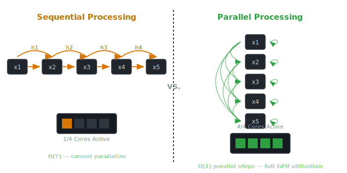
  <br>
  <em>Sequential RNN Bottleneck vs. Parallel Transformer Self-Attention Vector Diagram.</em>
</p>

```text
RNN Bottleneck:
h1 -> h2 -> h3 -> h4 -> h5  (each arrow = one serial compute step)
GPU: [■□□□□□□□] 1/8 cores active (rest idle)
```

Despite the architectural improvements of LSTMs and GRUs, three fundamental bottlenecks hindered scaling:

1. **Sequential Compute Bottleneck:** Computing $h_t$ strictly requires $h_{t-1}$. Training cannot be parallelized across temporal sequence length $T$. GPU hardware cores remain underutilized because sequence computation is inherently serial $O(T)$.
2. **Vanishing and Exploding Gradients:** Backpropagation Through Time (BPTT) requires repeatedly multiplying weight matrices $W_{hh}$ over $T$ timesteps. The gradient scale decays or explodes exponentially according to the spectral radius of $W_{hh}$:
   $$\frac{\partial \mathcal{L}}{\partial h_1} = \frac{\partial \mathcal{L}}{\partial h_T} \prod_{k=2}^T \frac{\partial h_k}{\partial h_{k-1}}$$
3. **Information Compression Bottleneck:** Long-range contextual information must be continually compressed into a single fixed-size hidden vector $h_t$, causing progressive loss of early tokens.

---

## Module 2: The Transformer Decoder Architecture

> **Intuition:** The Transformer decoder throws away sequential reading. Instead, it looks at the entire sequence of words at once, allowing every word to form direct connections with every preceding word. This architecture powers modern GPT models.

The Transformer architecture (*Vaswani et al., 2017*) resolved the sequential bottleneck by replacing recurrences entirely with **Self-Attention**. NanoBrain specifically implements the **Decoder-Only Transformer** (pioneered by GPT-* Radford et al.*), where every token can directly attend to all previous tokens simultaneously in parallel operations.

<p align="center">
  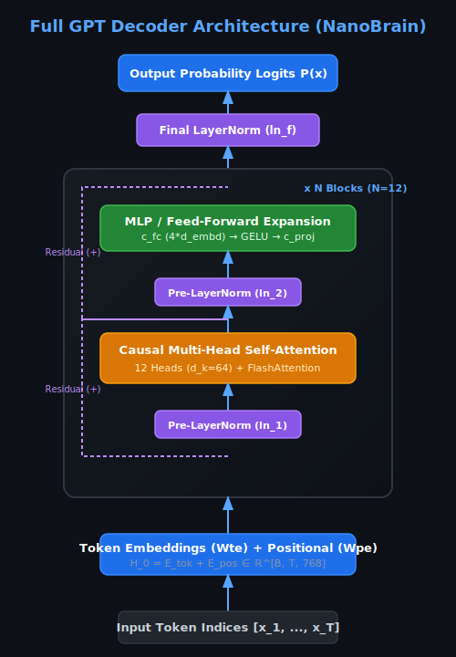
  <br>
  <em>Full GPT Decoder Architecture Vector Diagram.</em>
</p>

---

### 2.1 High-Dimensional Vector Spaces and Embedding Representation

> **Intuition:** Computers cannot multiply words; they can only multiply numbers. An embedding transforms a discrete word index into a point in a multi-dimensional space (e.g., 768 dimensions), where words with similar meanings (like "king" and "queen") end up close to each other.

Text tokens are discrete symbols. To process them through continuous matrix linear algebra, each discrete token integer ID $x_t \in \{0, 1, \dots, |V|-1\}$ is mapped into a continuous high-dimensional vector space $\mathbb{R}^{d_{embd}}$.

In NanoBrain (GPT-2 Small parameter scale), $d_{embd} = 768$.

The input sequence of token indices $X \in \mathbb{N}^{B \times T}$ is transformed into an input embedding tensor $E_{tok} \in \mathbb{R}^{B \times T \times d_{embd}}$ via an embedding matrix lookup $W_{te} \in \mathbb{R}^{|V| \times d_{embd}}$:

$$E_{tok} = \text{Lookup}(X, W_{te})$$

---

### 2.2 Tokenization Mechanics: Byte-Pair Encoding (BPE)

> **Intuition:** Instead of splitting text word-by-word (which creates a massive dictionary) or character-by-character (which creates super long sentences), Byte-Pair Encoding (BPE) merges common pairs of letters into subword pieces. For instance, "unbelievable" becomes "un", "believ", and "able".

Tokenization is the mapping layer between string characters and numerical token IDs. NanoBrain utilizes **Byte-Pair Encoding (BPE)** via OpenAI’s `tiktoken` library.

*Note on Vocabulary Sizes:* The standard OpenAI GPT-2 base tokenizer contains $|V| = 50,257$ subword tokens. In NanoBrain's `config.py`, `vocab_size` is configured as `50258`. This $+1$ token allocation is a common optimization pattern that reserves an explicit slot for special control tokens (such as a dedicated `<|endoftext|>` or padding index) or rounds vocabulary sizes to GPU-friendly multiples.

```
Raw String: "unbelievable"
Character Level: ['u', 'n', 'b', 'e', 'l', 'i', 'e', 'v', 'a', 'b', 'l', 'e'] (Length: 12)
BPE Subwords:    ["un", "believ", "able"]                                     (Length: 3)
Token IDs:       [3415, 29194, 1284]
```

---

### 2.3 Positional Representations: Absolute vs. Rotary (RoPE)

> **Intuition:** Because attention processes all words simultaneously, the model has no default idea of word order. Without positional embeddings, "dog bites man" and "man bites dog" would look identical. Positional embeddings inject a sense of time and order into each word vector.

<p align="center">
  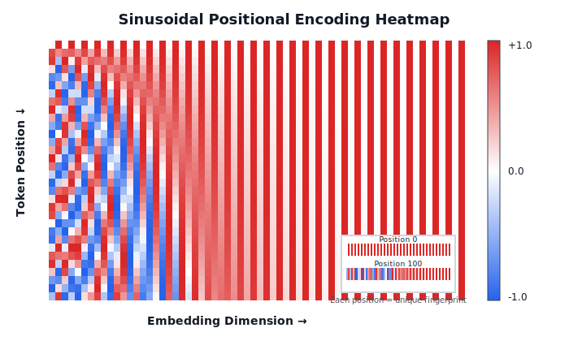
  <br>
  <em>Vector Heatmap of Sinusoidal Positional Encoding Patterns (Vaswani et al. Fixed Scheme).</em>
</p>

Historically, the original Transformer paper (*Vaswani et al., 2017*) introduced fixed, non-learnable **Sinusoidal Positional Encodings** (visualized above) using alternating sine and cosine functions of varying frequencies to map token positions to vectors. Subsequent architectures evolved this concept into learned parameters and relative rotation matrices:

#### 1. Absolute Learned Positional Embeddings (NanoBrain / GPT-2)
NanoBrain defines a trainable parameter matrix $W_{pe} \in \mathbb{R}^{T_{max} \times d_{embd}}$ where $T_{max} = 1024$. For sequence length $T$, position indices $P = (0, 1, 2, \dots, T-1)$ are mapped to embeddings $E_{pos} \in \mathbb{R}^{B \times T \times d_{embd}}$ and directly summed element-wise with token embeddings:

$$H_0 = E_{tok} + E_{pos} = \text{Lookup}(X, W_{te}) + \text{Lookup}(P, W_{pe})$$

#### 2. Rotary Position Embeddings (RoPE - Used in LLaMA / Modern LLMs)
Modern architectures (LLaMA, Mistral) apply a complex rotation matrix to the Query ($Q$) and Key ($K$) representations in 2D vector pairs:

$$R_{\Theta, m}^d = \text{diag}\left( R_{\theta_1, m}, R_{\theta_2, m}, \dots, R_{\theta_{d/2}, m} \right)$$

$$R_{\theta_i, m} = \begin{pmatrix} \cos(m\theta_i) & -\sin(m\theta_i) \\ \sin(m\theta_i) & \cos(m\theta_i) \end{pmatrix}$$

---

### 2.4 Causal Multi-Head Self-Attention (MHSA)

> **Intuition:** Self-attention allows every word to ask a question ("Query"), check matching keys from earlier words ("Keys"), and extract relevant context ("Values"). The word "it" in "The bank approved the loan because it had money" uses self-attention to link "it" back to "bank". The "causal" part means a word can only look at past words, never future ones.

<p align="center">
  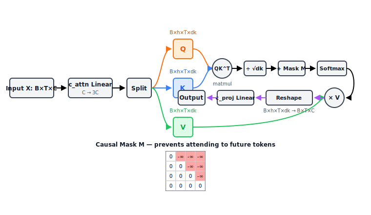
  <br>
  <em>Causal Multi-Head Self-Attention Architecture Vector Diagram.</em>
</p>

Before the attention calculation, Multi-Head Attention reshapes these matrices to split the computation across `h` parallel heads:
`Q, K, V ∈ R^[B×T×d_embd] → reshape → R^[B×h×T×d_k]`
*(For NanoBrain: `h=12`, `d_embd=768`, `d_k=64`)*

Given an input tensor $X \in \mathbb{R}^{B \times T \times d_{embd}}$, three distinct linear projections generate Queries ($Q$), Keys ($K$), and Values ($V$):

$$Q = X W_Q, \quad K = X W_K, \quad V = X W_V$$

In NanoBrain, a single unified linear layer `c_attn` projects $X$ into $3 \cdot d_{embd}$ dimensions:

$$\text{qkv} = \text{Linear}_{d_{embd} \to 3d_{embd}}(X) \implies Q, K, V \in \mathbb{R}^{B \times T \times d_{embd}}$$

#### The Scaled Dot-Product Attention Equation

$$\text{Attention}(Q, K, V) = \text{softmax}\left( \frac{Q K^T}{\sqrt{d_k}} + M \right) V$$

```text
Fallback: Attention(Q, K, V) = softmax( (Q * K^T) / sqrt(d_k) + M ) * V
```

#### Causal Masking (M)
To prevent the model from "looking ahead" at future tokens, a causal mask $M$ is applied. $M$ is a lower-triangular matrix filled with $-\infty$ above the diagonal, which forces the softmax to assign exactly 0 probability to future tokens.

```text
4x4 Causal Mask Matrix M:
[[ 0, -inf, -inf, -inf],
 [ 0,    0, -inf, -inf],
 [ 0,    0,    0, -inf],
 [ 0,    0,    0,    0]]
```

#### Why Scale by $\sqrt{d_k}$?
Assuming components of $Q$ and $K$ are independent random variables with mean 0 and variance 1, their dot product $q \cdot k = \sum_{i=1}^{d_k} q_i k_i$ has a mean of 0 and variance of $d_k$. Dividing by $\sqrt{d_k}$ scales variance back to 1.0, preventing softmax saturation gradients:

$$\frac{\partial \text{softmax}(z)_i}{\partial z_j} \approx 0 \quad \text{for } |z_i| \gg 0$$

---

### 2.5 Non-Linear Activations: GELU vs. ReLU vs. SwiGLU

> **Intuition:** Neural networks need non-linear functions to learn complex patterns. Without them, stacking 100 layers of neural networks would collapse into a single basic linear equation. GELU acts like a smooth dimmer switch rather than a harsh on/off toggle.

<p align="center">
  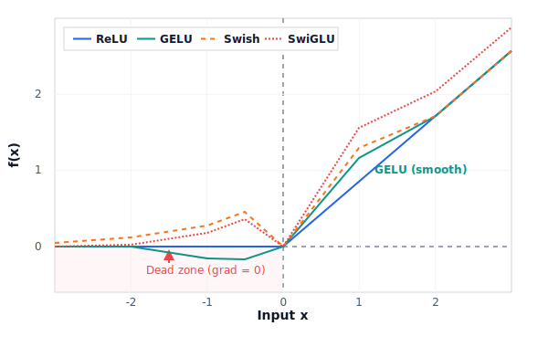
  <br>
  <em>Exact Mathematical Comparison of ReLU, GELU, and Swish/SwiGLU Curves.</em>
</p>

The Multi-Layer Perceptron (MLP) block processes outputs from the attention layer. It expands hidden dimensions by a factor of 4 ($d_{embd} \to 4 d_{embd} \to d_{embd}$):

$$\text{MLP}(H) = \left( \text{Activation}(H W_1 + b_1) \right) W_2 + b_2$$

Why 4x expansion? Empirically chosen in the original Transformer paper, the 4x expansion factor provides optimal memory-to-parameter capacity for non-linear pattern storage.

---

### 2.6 Normalization Topologies and The Residual Highway

> **Intuition:** As neural networks grow very deep, signals can fade away or blow up out of control. Residual connections create a "superhighway" for signals to bypass layers directly, while Layer Normalization keeps numbers bounded within a healthy range.

#### 1. The Residual Stream (Highway Connection)
$$x_{l+1} = x_l + \text{SubLayer}(\text{Norm}(x_l))$$

Gradients flow backwards directly through addition operations without scaling degradation:

$$\frac{\partial x_{l+1}}{\partial x_l} = I + \frac{\partial \text{SubLayer}(\text{Norm}(x_l))}{\partial x_l}$$

#### 2. Layer Normalization (LayerNorm)
$$\hat{x}_i = \frac{x_i - \mu}{\sqrt{\sigma^2 + \epsilon}} \cdot \gamma_i + \beta_i$$

---

### 2.7 Weight Tying Mechanics

> **Intuition:** Words mean the same thing whether you are reading them at the start of a sentence or predicting them at the end. Weight tying reuses the exact same embedding dictionary matrix for both input token reading and output word prediction, saving 38.6 Million parameters!

<p align="center">
  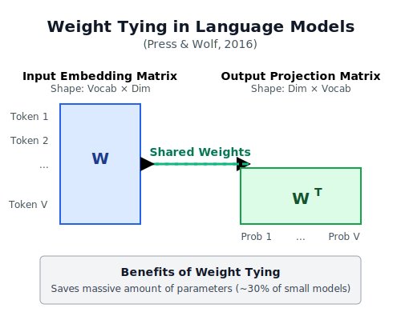
  <br>
  <em>Weight Tying Architecture (wte == lm_head).</em>
</p>

In NanoBrain (and GPT-2 / Press & Wolf 2017), the input token embedding matrix $W_{te} \in \mathbb{R}^{|V| \times d_{embd}}$ and the final output language model head matrix $W_{lm\_head} \in \mathbb{R}^{d_{embd} \times |V|}$ share the exact same parameter memory tensor:

$$W_{lm\_head} = W_{te}^T$$

- **Parameter Savings:** Eliminates an entire second matrix of size $50,258 \times 768$, saving **38,598,144 parameters** (~31% of total model size).
- **Semantic Alignment:** Forces the network to learn a unified vector space where input token representations directly align with target output logit spaces.

---

## Module 3: Computational and Hardware Optimizations

---

### 3.1 GPU Memory Architecture: SRAM vs. HBM

> **Intuition:** A GPU has two types of memory: a tiny, ultra-fast scratchpad right next to the processor (SRAM), and a huge, slower storage pool (HBM/VRAM). If your GPU spends all its time moving data back and forth between storage and the processor, training runs slowly regardless of compute power.

```
+-------------------------------------------------------------------+
|                            NVIDIA GPU                             |
|                                                                   |
|  +-------------------------------------------------------------+  |
|  |                 SRAM (On-Chip L1 Cache)                     |  |
|  |   Capacity: ~20-50 MB  |  Bandwidth: ~19,000 GB/s (Ultra)   |  |
|  +-------------------------------------------------------------+  |
|                                ▲                                  |
|                     Memory Access Bottleneck                      |
|                                ▼                                  |
|  +-------------------------------------------------------------+  |
|  |               HBM / VRAM (High Bandwidth Memory)            |  |
|  |   Capacity: 12-80 GB   |  Bandwidth: ~1,500-3,000 GB/s     |  |
|  +-------------------------------------------------------------+  |
+-------------------------------------------------------------------+
```

---

### 3.2 FlashAttention: Tiling, Online Softmax, and Kernel Fusion

> **Intuition:** Standard attention writes huge intermediate grids to slow GPU memory. FlashAttention breaks matrices into small tiles that fit entirely inside ultra-fast SRAM, calculates attention in chunks, and writes back only the final answer. This slashes memory usage and speeds up training.

<p align="center">
  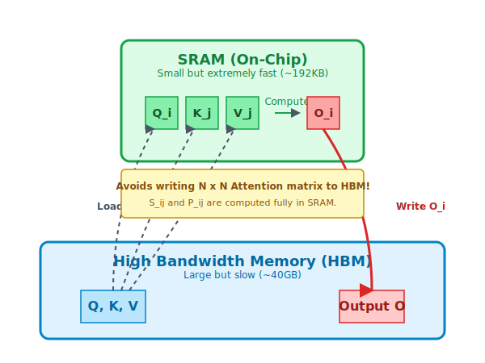
  <br>
  <em>GPU SRAM vs HBM Memory Hierarchy &amp; FlashAttention Tiled Execution Strategy Vector Diagram.</em>
</p>

**FlashAttention** (*Dao et al., 2022*) reduces memory I/O complexity from $O(T^2)$ to $O(T)$ via:
1. **Tiling:** Partition input matrices $Q, K, V$ into SRAM-sized blocks.
2. **Online Softmax:** Compute max-scaling factors dynamically.
3. **Kernel Fusion:** Compute forward and backward passes without materializing $T \times T$ intermediate matrices in HBM.

---

### 3.3 Numerical Precision Formats: FP32, FP16, BF16, TF32

| Format | Total Bits | Exponent Bits | Mantissa Bits | Dynamic Range | Precision |
| :--- | :---: | :---: | :---: | :--- | :--- |
| **FP32** | 32 | 8 | 23 | $10^{-38} \dots 10^{38}$ | High |
| **FP16** | 16 | 5 | 10 | $6 \times 10^{-5} \dots 65504$ | Low (Prone to underflow) |
| **BF16** | 16 | 8 | 7 | $10^{-38} \dots 10^{38}$ | Same as FP32 (Robust) |
| **TF32** | 19 (internal) | 8 | 10 | Same as FP32 | Medium |

```text
Bit Layout Comparison:
FP32: [S(1)] [Exponent(8)]  [Mantissa(23)]
FP16: [S(1)] [Exponent(5)]  [Mantissa(10)]  <-- Tiny exponent causes underflow
BF16: [S(1)] [Exponent(8)]  [Mantissa(7)]   <-- Exact same range as FP32!
```

---

### 3.4 Mixed-Precision Training (AMP) and Gradient Scaling

> **Intuition:** Mixed-Precision training uses fast 16-bit math for heavy matrix calculations, but keeps a high-precision 32-bit copy of master weights in memory so tiny mathematical updates aren't lost to rounding errors.

NanoBrain leverages Automatic Mixed Precision (AMP) via `torch.amp.autocast("cuda", dtype=torch.bfloat16)`. `GradScaler` multiplies loss by scale $S$ during FP16 training to prevent gradient underflow. Under BF16, `GradScaler` acts as a harmless no-op.

```text
Mixed Precision Flow:
Forward (BF16) -> Loss -> Scaled Backprop -> Unscale -> FP32 Optimizer Step
```

---

### 3.5 Gradient Accumulation and Gradient Clipping

- **Gradient Accumulation:** Accumulates gradients across $K=8$ micro-steps ($B_{micro}=8 \implies B_{eff}=64$), simulating large batch training without VRAM OOM.
  $$\bar{g} = \frac{1}{K} \sum_{k=1}^K \nabla_{\theta} \mathcal{L}(\theta; X_k)$$
  ```text
  For step 1 to K:
    loss = forward(micro_batch) / K
    loss.backward()  # Gradients add up
  optimizer.step()   # Single update after K steps
  ```
- **Gradient Clipping:** Clips gradient norm $\|g\|_2 > 1.0$ to prevent loss spikes.

---

### 3.6 Weight Decay, Fused AdamW, and Learning Rate Scheduling

<p align="center">
  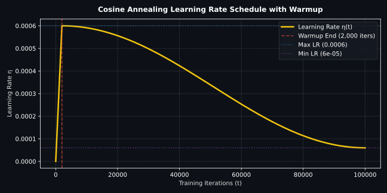
  <br>
  <em>Linear Warmup + Cosine Annealing Learning Rate Schedule.</em>
</p>

NanoBrain uses Fused AdamW with decoupled weight decay ($\lambda = 0.1$) excluding 1D LayerNorm/bias parameters, paired with a 2,000-step linear warmup decaying down to $\eta_{min} = 6 \times 10^{-5}$ over 100,000 steps.

**Why decoupled weight decay (AdamW)?**
Standard L2 regularization $\mathcal{L} + \lambda ||\theta||^2$ weakens when interacting with Adam's adaptive variance scaling (weights with large gradients are barely decayed). AdamW decouples it by directly subtracting $\eta \lambda \theta_t$ during the parameter update:

$$\theta_{t} = \theta_{t-1} - \eta_t \left( \alpha \frac{\hat{m}_t}{\sqrt{\hat{v}_t} + \epsilon} + \lambda \theta_{t-1} \right)$$

---

### 3.7 Exponential Moving Average (EMA) of Weights

NanoBrain maintains a running shadow copy of parameters $\theta_{EMA}$:

$$\theta_{EMA}^{(t)} = \beta_{ema} \theta_{EMA}^{(t-1)} + (1 - \beta_{ema}) \theta_t \quad (\beta_{ema} = 0.999)$$

Applied during validation evaluation to smooth loss curves and boost out-of-domain generalization.

*Note on Bias Correction:* Early in training, EMA is heavily biased towards the initial $\theta_0$. Bias correction $\theta_{EMA\_corrected} = \theta_{EMA} / (1 - \beta^t)$ is sometimes applied. However, NanoBrain's `model.py` EMA implementation skips bias correction for simplicity, relying on sufficient training steps to wash out the initial state:

```python
# Inside EMA.update()
for name, param in model.named_parameters():
    if param.requires_grad:
        self.shadow[name].data.mul_(self.decay).add_(param.data, alpha=1.0 - self.decay)
```

---

## Module 4: Text Generation and Decoding Mechanics

---

### 4.1 Autoregressive Sampling Loop

Generates text by predicting next token $x_{T+1} \sim P(x \mid x_{\le T})$, appending $x_{T+1}$ to prompt context, and iteratively repeating forward inference.

---

### 4.2 Softmax Temperature Scaling

Scales logits by temperature $T > 0$ before Softmax:

$$P(x_i) = \frac{\exp(z_i / T)}{\sum_j \exp(z_j / T)}$$

- $T=0.2$: Peak distribution (deterministic, greedy).
- $T=1.0$: Standard model probabilities.
- $T=1.5$: Flattened distribution (high diversity/creativity).

---

### 4.3 Truncation Algorithms: Top-K and Top-p (Nucleus) Sampling

<p align="center">
  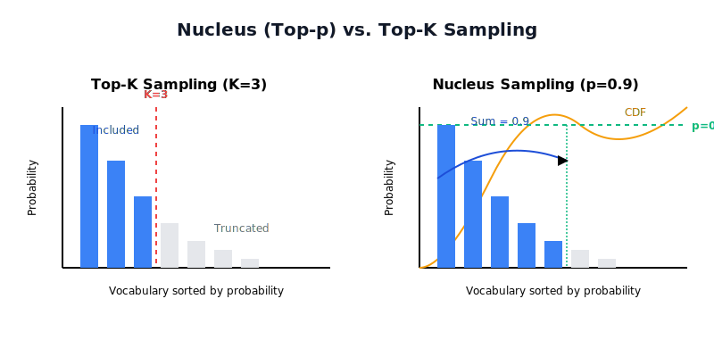
  <br>
  <em>Temperature Scaling Distributions and Top-K / Top-p (Nucleus) Truncation Sampling.</em>
</p>

- **Top-K ($K=3$):** Restricts choices strictly to top $K$ candidates.
- **Top-p Nucleus ($p=0.80$):** Dynamically retains smallest set of tokens whose cumulative probability $\sum P(x_i) \ge p$.

---

### 4.4 Key-Value (KV) Caching During Inference

> **Intuition:** During text generation, word 101 needs the Keys and Values of words 1 to 100. Without caching, the GPU would re-calculate Keys and Values for words 1 to 100 over and over again for every single new word. A KV Cache stores past Keys and Values in memory so the model only computes the single new word.

<p align="center">
  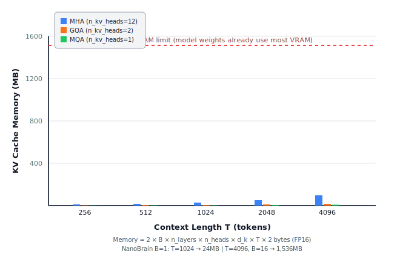
  <br>
  <em>KV Cache Memory Growth vs. Context Length T.</em>
</p>

During autoregressive generation, computing attention for a new token at step $t$ requires Keys $K_{\le t}$ and Values $V_{\le t}$. Without caching, time complexity grows as $O(T^2)$ due to redundant past token matrix multiplications.

**KV Cache Formula:**
$$\text{Memory}_{KV} = 2 \times b \times n_{layers} \times n_{heads} \times d_k \times T \times \text{bytes\_per\_elem}$$

```text
Fallback: Memory = 2 * batch * layers * heads * d_k * seq_len * bytes
```

For NanoBrain (12 layers, 12 heads, $d_k=64$, FP16 precision):
- At $T=1,024$, batch size $B=1$: $\sim 24 \text{ MB}$.
- At $T=4,096$, batch size $B=16$: $\sim 6.03 \text{ GB}$ VRAM overhead!

For a model with $n_{kv\_heads}=2$ (GQA) instead of $n_{heads}=12$, cache memory shrinks by $6\times$. This is exactly the tradeoff Section 5.2 explores.

---

## Module 5: Modern Industry Evolution and Comparative Architecture

---

### 5.1 Architectural Shift: GPT-2 (NanoBrain) vs. LLaMA 1/2/3 and Mistral

| Architectural Component | NanoBrain (GPT-2 Base) | Modern Standard (LLaMA 3 / Mistral) | Advantage of Modern Approach |
| :--- | :--- | :--- | :--- |
| **Positional Encoding** | Absolute Learned ($W_{pe}$) | Rotary Positional Embedding (RoPE) | Extrapolates to longer context lengths ($>128\text{K}$) |
| **Normalization Layer** | LayerNorm (Mean + Variance) | RMSNorm (Root Mean Square) | 10–50% faster computation by dropping mean calculation |
| **Activation Function** | GELU (`approximate="tanh"`) | SwiGLU Gated Activation | Higher parameter expressivity per FLOP |
| **Attention Mechanism** | Multi-Head Attention (MHA) | Grouped-Query Attention (GQA) | Reduces KV Cache VRAM footprint during multi-user inference |
| **Normalization Position** | Pre-LN | Pre-LN with RMSNorm | More stable gradients, slightly faster |
| **Attention Kernel** | FlashAttention-1/SDPA | FlashAttention-2/3 | Significantly higher TFLOPS utilization |
| **Bias Vectors** | Optional biases in Linear | No biases (`bias=False`) | Saves memory and compute, negligible quality drop |

---

### 5.2 Grouped-Query Attention (GQA) and Multi-Query Attention (MQA)

<p align="center">
  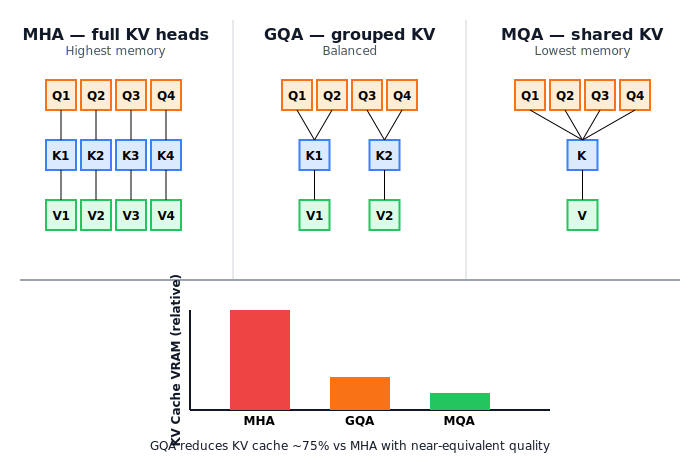
  <br>
  <em>Structural Comparison of Multi-Head Attention (MHA), Grouped-Query Attention (GQA), and Multi-Query Attention (MQA).</em>
</p>

GQA partitions 12 Query heads into groups that share 2 or 4 Key/Value heads, slashing KV Cache memory footprint by 75% while matching standard MHA modeling quality.

---

## Module 6: Post-Pretraining Pipeline: Alignment and Fine-Tuning

> **Intuition:** Pretraining teaches a model language structure by reading internet text, making it a great document completer. Post-pretraining aligns the model into a helpful, safe assistant that answers questions directly instead of just continuing text.

<p align="center">
  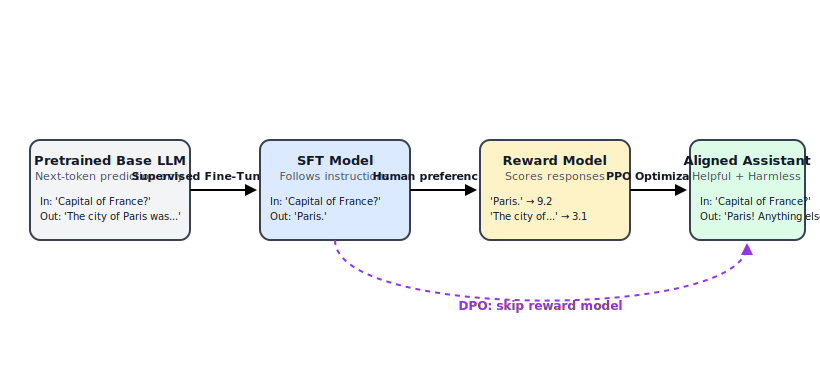
  <br>
  <em>Post-Pretraining Alignment Pipeline (Pretraining → SFT → RLHF / DPO).</em>
</p>

---

### 6.1 Supervised Fine-Tuning (SFT)

> **Intuition:** A pretrained model is like a brilliant person who has read the entire internet but never had a conversation. SFT gives it thousands of example conversations to teach it that questions deserve answers, not more text completions.

Supervised Fine-Tuning adapts a base pretrained model to instruction-following task structures by training on curated `(Prompt, Response)` datasets (e.g., UltraFeedback, ShareGPT):

$$\mathcal{L}_{SFT}(\theta) = -\sum_{i=1}^{|Y|} \log P(y_i \mid x, y_{<i}; \theta)$$

Loss is calculated exclusively over target response tokens $y$, ignoring prompt context tokens $x$.

---

### 6.2 Reinforcement Learning from Human Feedback (RLHF) & PPO

> **Intuition:** Even after SFT, the model may give technically correct but unhelpful or unsafe answers. RLHF trains a 'judge' model (the Reward Model) on human preferences, then uses reinforcement learning to nudge the main model toward outputs the judge scores highly.

1. **Reward Model (RM):** Trained on human pairwise comparisons $(x, y_w, y_l)$ where $y_w$ is preferred over $y_l$:
   $$\mathcal{L}_{RM}(\phi) = -\mathbb{E}_{(x, y_w, y_l)} \left[ \log \sigma \left( r_\phi(x, y_w) - r_\phi(x, y_l) \right) \right]$$
2. **PPO Policy Optimization:** Optimizes policy model $\pi_\theta$ to maximize reward $r_\phi$ while adding a KL-divergence penalty against original base model $\pi_{ref}$:
   $$\text{Objective}(\theta) = \mathbb{E} [r_\phi(x, y)] - \beta D_{KL}(\pi_\theta(y \mid x) \parallel \pi_{ref}(y \mid x))$$

---

### 6.3 Direct Preference Optimization (DPO)

> **Intuition:** RLHF requires training two models and running complex RL loops. DPO discovered that you can skip all of that — the preference signal can be directly baked into the model's own probability ratios using a simple classification loss.

**Direct Preference Optimization** (*Rafailov et al., 2023*) eliminates the need for training a separate Reward Model or running complex PPO reinforcement learning loops. DPO reparameterizes the reward function directly in terms of policy probabilities:

$$\mathcal{L}_{DPO}(\theta) = -\mathbb{E}_{(x, y_w, y_l)} \left[ \log \sigma \left( \beta \log \frac{\pi_\theta(y_w \mid x)}{\pi_{ref}(y_w \mid x)} - \beta \log \frac{\pi_\theta(y_l \mid x)}{\pi_{ref}(y_l \mid x)} \right) \right]$$

```text
Fallback: Loss = -E[ log( sigmoid( beta * log(P_win/Ref_win) - beta * log(P_lose/Ref_lose) ) ) ]
```

DPO achieves state-of-the-art alignment quality with simple, stable cross-entropy classification loss.

---

### 6.4 Instruction Templates and Chat Formats

To distinguish system prompts, user queries, and assistant replies during inference, text is formatted using explicit control tokens (e.g., OpenAI ChatML format):

```
<|im_start|>system
You are NanoBrain, a helpful AI assistant.<|im_end|>
<|im_start|>user
What is FlashAttention?<|im_end|>
<|im_start|>assistant
FlashAttention is an I/O-aware attention algorithm...<|im_end|>
```

---

# PART 2: CODEBASE ARCHITECTURE AND IMPLEMENTATION

---

## Module 7: NanoBrain Codebase Walkthrough

```
GPT/
├── config.py             # GPTConfig dataclass definition & methods
├── config.json           # Active hyperparameter values
├── model.py              # PyTorch modules (LayerNorm, Attention, MLP, GPT, EMA)
├── build_dataset.py      # Streaming raw datasets & corpus compilation
├── tokenize_dataset.py   # Pre-tokenizing text to uint16 train.bin / val.bin
├── dataset.py            # BinDataset (np.memmap) & DataLoader creation
├── trainer.py            # Trainer class (AMP, GradScaler, Logging, Eval, Checkpointing)
├── train.py              # Main entry point script
└── generate.py           # Text generation / inference script
```

---

### 7.1 Hyperparameter Configuration ([`config.py`](../config.py) / [`config.json`](../config.json))

The `GPTConfig` dataclass in [`config.py`](../config.py) encapsulates hyperparameter settings:

```python
@dataclass
class GPTConfig:
    vocab_size: int = 50258
    n_embd: int = 768
    n_head: int = 12
    n_layer: int = 12
    block_size: int = 1024
    batch_size: int = 8
    gradient_accumulation_steps: int = 8
    max_iters: int = 100000
    learning_rate: float = 6e-4
    weight_decay: float = 0.1
    dtype: str = "bfloat16"
```

#### Exact Parameter Sum: 124,339,200 Parameters
$$\text{Wte }(38.6\text{M}) + \text{Wpe }(786\text{K}) + 12 \times \text{Blocks }(85.0\text{M}) + \text{LN}_f (1.5\text{K}) = \mathbf{124,339,200}$$

```text
Per-Block Arithmetic Breakdown:
- c_attn (QKV):  768 x 2304 = 1,769,472
- c_proj:        768 x 768  = 589,824
- c_fc (MLP):    768 x 3072 = 2,359,296
- c_proj (MLP):  3072 x 768 = 2,359,296
- LayerNorm (2): 2 x 768    = 1,536
-----------------------------------------
Total per block:              7,079,424
```

---

### 7.2 Data Sourcing and Pre-Processing ([`build_dataset.py`](../build_dataset.py))

Streams 5 high-quality datasets (FineWeb-Edu, Wikipedia, CodeParrot, Gutenberg, FineMath), applies NFKC normalization, and compiles clean `data/corpus.txt`.

```python
DATA_MIX = {
    "fineweb-edu": {"weight": 0.40},
    "wikipedia": {"weight": 0.25},
    "codeparrot": {"weight": 0.15},
    "gutenberg": {"weight": 0.10},
    "finemath": {"weight": 0.10}
}
# Text cleaning pipeline
text = unicodedata.normalize("NFKC", text)
text = ''.join(c for c in text if unicodedata.category(c)[0] != 'C')
if len(text) < 300: return None
```

---

### 7.3 Binary Packing and Zero-Copy Data Loading ([`tokenize_dataset.py`](../tokenize_dataset.py) and [`dataset.py`](../dataset.py))

`tokenize_dataset.py` pre-tokenizes text into 16-bit binary files (`train.bin` / `val.bin`). `dataset.py` uses `np.memmap` for zero-copy data loading directly from disk.

*Why `np.memmap`?* Zero-copy loading prevents RAM exhaustion. The data remains on disk and is paged into memory by the OS only when requested by a batch.

```python
class BinDataset(Dataset):
    def __init__(self, bin_path, block_size):
        self.data = np.memmap(bin_path, dtype=np.uint16, mode='r')
        self.block_size = block_size
        
    def __getitem__(self, idx):
        # Slice directly from disk
        x = torch.from_numpy(self.data[idx : idx + self.block_size].astype(np.int64))
        y = torch.from_numpy(self.data[idx + 1 : idx + 1 + self.block_size].astype(np.int64))
        return x, y
```

---

### 7.4 PyTorch Model Implementation ([`model.py`](../model.py))

Houses core PyTorch neural network modules: `LayerNorm`, `CausalSelfAttention`, `MLP`, `Block`, `GPT`, and `EMA`.

```python
class CausalSelfAttention(nn.Module):
    def forward(self, x):
        B, T, C = x.size()
        qkv = self.c_attn(x)
        q, k, v = qkv.split(self.n_embd, dim=2)
        
        # Reshape to multi-head: [B, T, C] -> [B, h, T, d_k]
        k = k.view(B, T, self.n_head, C // self.n_head).transpose(1, 2)
        q = q.view(B, T, self.n_head, C // self.n_head).transpose(1, 2)
        v = v.view(B, T, self.n_head, C // self.n_head).transpose(1, 2)
        
        # FlashAttention (SDPA)
        y = F.scaled_dot_product_attention(q, k, v, is_causal=True)
        y = y.transpose(1, 2).contiguous().view(B, T, C)
        return self.c_proj(y)
```

Weight initialization follows the GPT-2 scaling rule, where residual projection weights are scaled down by $1/\sqrt{2N}$ (where $N$ is `n_layer`) to prevent variance explosion early in training.

---

### 7.5 Unified Training Engine ([`trainer.py`](../trainer.py) and [`train.py`](../train.py))

Executes training loop with AMP `bfloat16`, `GradScaler`, gradient accumulation, EMA updates, and validation logging.

#### 7.5.1 Reading Training Logs and Loss Curves
- **Initial Loss:** Starts near $\log(|V|) = \log(50,258) \approx 10.82$.
- **Early Convergence:** Rapidly drops to $\sim 4.5$ within 5,000 steps as base syntax is learned.
- **Pretraining Target:** Reaches $\sim 2.8 - 3.2$ cross-entropy loss at 100,000 steps.
- **Gradient Norms:** Healthy gradient norms hover stably between $0.5$ and $1.5$. Norm spikes $>5.0$ indicate gradient clipping activation.

---

### 7.6 Text Generation Script ([`generate.py`](../generate.py))

```python
# Temperature, Top-K, Top-P Nucleus Sampling Implementation
logits = logits[:, -1, :] / temperature

if top_k is not None:
    # Retain only top_k highest logit values
    v, _ = torch.topk(logits, min(top_k, logits.size(-1)))
    logits[logits < v[:, [-1]]] = -float("Inf")

if top_p is not None:
    # Sort logits descending and calculate cumulative probabilities
    sorted_logits, sorted_indices = torch.sort(logits, descending=True)
    cumulative_probs = torch.cumsum(F.softmax(sorted_logits, dim=-1), dim=-1)
    
    # Mask indices exceeding cumulative threshold p
    sorted_indices_to_remove = cumulative_probs > top_p
    sorted_indices_to_remove[..., 1:] = sorted_indices_to_remove[..., :-1].clone()
    sorted_indices_to_remove[..., 0] = 0
    indices_to_remove = sorted_indices_to_remove.scatter(1, sorted_indices, sorted_indices_to_remove)
    logits[indices_to_remove] = -float("Inf")

probs = F.softmax(logits, dim=-1)
idx_next = torch.multinomial(probs, num_samples=1)
```

---

# Appendix A: Glossary and Quick Reference

| Acronym / Term | Full Name / Definition |
| :--- | :--- |
| **AMP** | Automatic Mixed Precision (PyTorch `torch.amp.autocast`) |
| **BF16** | Bfloat16 (16-bit float with 8-bit exponent matching FP32 dynamic range) |
| **BPE** | Byte-Pair Encoding (subword tokenization algorithm) |
| **BPTT** | Backpropagation Through Time (RNN gradient training) |
| **c_attn** | Combined Linear projection layer for Query, Key, and Value matrices |
| **c_proj** | Output projection linear layer following attention or MLP |
| **DPO** | Direct Preference Optimization (SFT-based alignment without reward model) |
| **EMA** | Exponential Moving Average (shadow parameter weight smoothing) |
| **FlashAttention** | Memory-efficient fused attention algorithm utilizing GPU SRAM tiling |
| **FP16** | Half Precision (16-bit floating point format) |
| **FP32** | Single Precision (32-bit standard floating point format) |
| **GELU** | Gaussian Error Linear Unit ($\text{GELU}(x) = x \cdot \Phi(x)$) |
| **GQA** | Grouped-Query Attention (Query heads share grouped Key/Value heads) |
| **HBM** | High Bandwidth Memory (off-chip GPU VRAM) |
| **KV Cache** | Key-Value Cache (stores past attention vectors during inference) |
| **LayerNorm** | Layer Normalization (normalizes feature dimensions per token) |
| **MHA** | Multi-Head Attention (1:1 Query to Key/Value head ratio) |
| **MHSA** | Multi-Head Self-Attention |
| **MLP** | Multi-Layer Perceptron (Feed-Forward network sub-block) |
| **MQA** | Multi-Query Attention (All Query heads share 1 Key/Value head) |
| **NFKC** | Unicode Normalization Form Compatibility Composition |
| **Nucleus Sampling** | Top-p sampling (truncates cumulative probability tails at threshold $p$) |
| **Pre-LN** | Pre-Layer Normalization topology (LayerNorm applied before sub-layer) |
| **PPO** | Proximal Policy Optimization (reinforcement learning algorithm for RLHF) |
| **ReLU** | Rectified Linear Unit ($\max(0, x)$) |
| **RLHF** | Reinforcement Learning from Human Feedback |
| **RoPE** | Rotary Position Embeddings (2D vector rotation relative encodings) |
| **SDPA** | Scaled Dot-Product Attention (`F.scaled_dot_product_attention`) |
| **SFT** | Supervised Fine-Tuning (instruction-following task dataset training) |
| **SRAM** | Static Random-Access Memory (fast on-chip GPU L1 cache memory) |
| **SwiGLU** | Swish Gated Linear Unit activation function |
| **TF32** | TensorFloat-32 (NVIDIA Ampere internal 19-bit math format) |
| **tiktoken** | Fast Byte-Pair Encoding tokenizer library by OpenAI |
| **Wpe** | Positional Embedding parameter matrix |
| **Wte** | Token Embedding parameter matrix |

---

# Appendix B: References and Further Reading

1. **Attention Is All You Need** (Vaswani et al., 2017): [arXiv:1706.03762](https://arxiv.org/abs/1706.03762)
2. **Language Models are Unsupervised Multitask Learners (GPT-2)** (Radford et al., 2019): [OpenAI Publication](https://cdn.openai.com/better-language-models/language_models_are_unsupervised_multitask_learners.pdf)
3. **FlashAttention: Fast and Memory-Efficient Exact Attention with IO-Awareness** (Dao et al., 2022): [arXiv:2205.14135](https://arxiv.org/abs/2205.14135)
4. **The Curious Case of Neural Text Degeneration (Top-p Nucleus Sampling)** (Holtzman et al., 2019): [arXiv:1904.09751](https://arxiv.org/abs/1904.09751)
5. **Decoupled Weight Decay Regularization (AdamW)** (Loshchilov & Hutter, 2017): [arXiv:1711.05101](https://arxiv.org/abs/1711.05101)
6. **Direct Preference Optimization: Your Language Model is Secretly a Reward Model** (Rafailov et al., 2023): [arXiv:2305.18290](https://arxiv.org/abs/2305.18290)
7. **RoFormer: Enhanced Transformer with Rotary Position Embedding** (Su et al., 2021): [arXiv:2104.09864](https://arxiv.org/abs/2104.09864)
8. **Using the Output Embedding to Improve Language Models (Weight Tying)** (Press & Wolf, 2017): [arXiv:1608.05859](https://arxiv.org/abs/1608.05859)

---

# Summary and Best Practices for Experimentation

Congratulations! You now have a first-principles understanding of Large Language Models and the complete implementation details of the NanoBrain codebase.

### Quickstart Command Sequence

```bash
# 0. Install Python dependencies
pip install torch tiktoken datasets transformers numpy tensorboard

# 1. Download and construct the text dataset corpus (Target: 1 GB)
python build_dataset.py

# 2. Pre-tokenize corpus into uint16 train.bin and val.bin files
python tokenize_dataset.py --input data/corpus.txt --split 0.9

# 3. Launch mixed-precision model training
python train.py

# 4. Generate text samples from the trained checkpoint
python generate.py "Artificial Intelligence is"
```

Happy modeling! For questions or contributions, feel free to open an issue or pull request on the repository.
